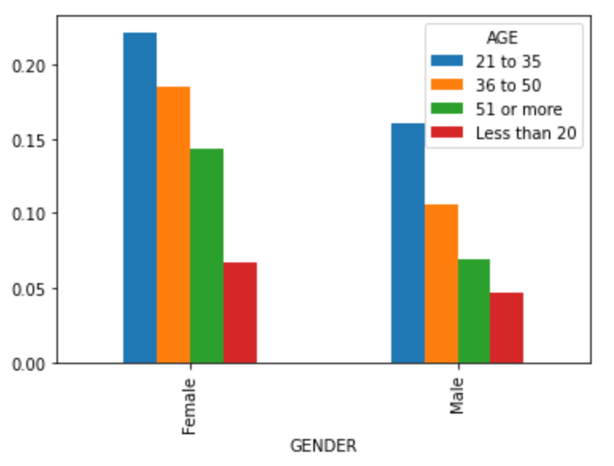
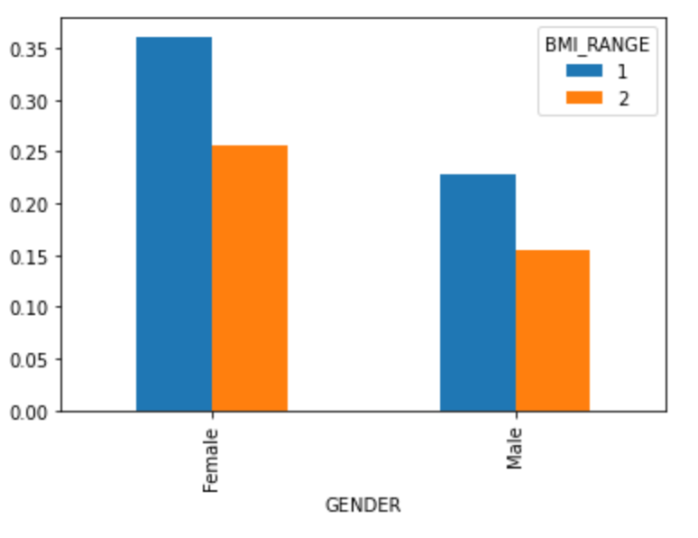
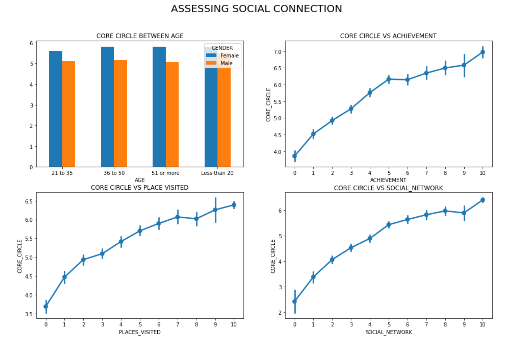
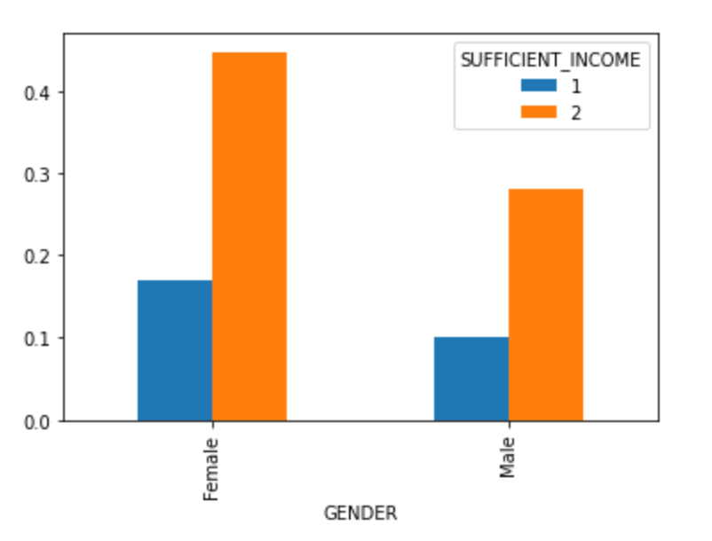
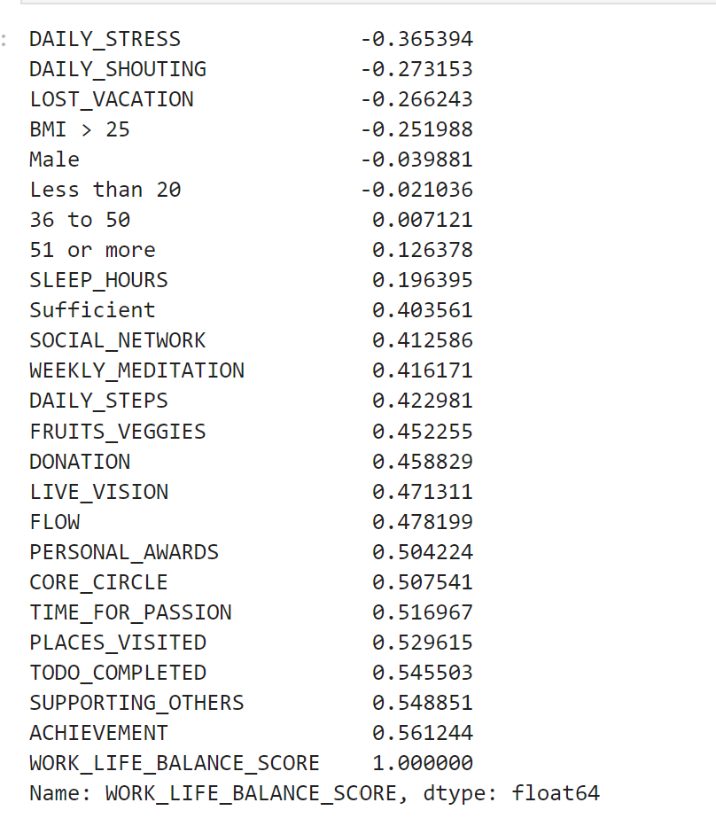
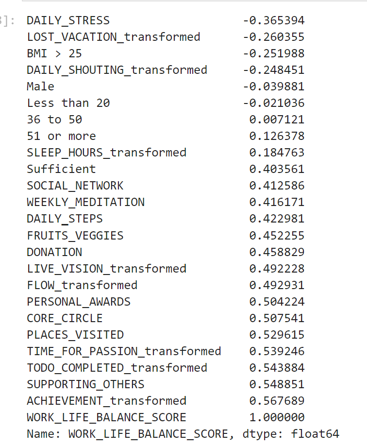
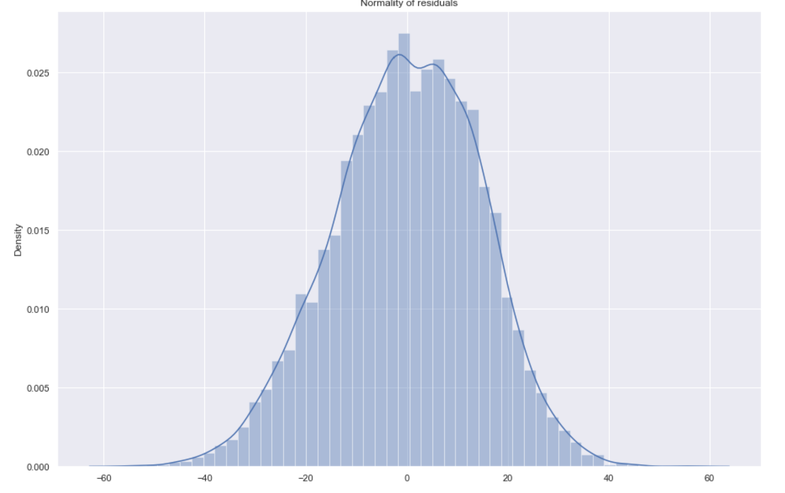
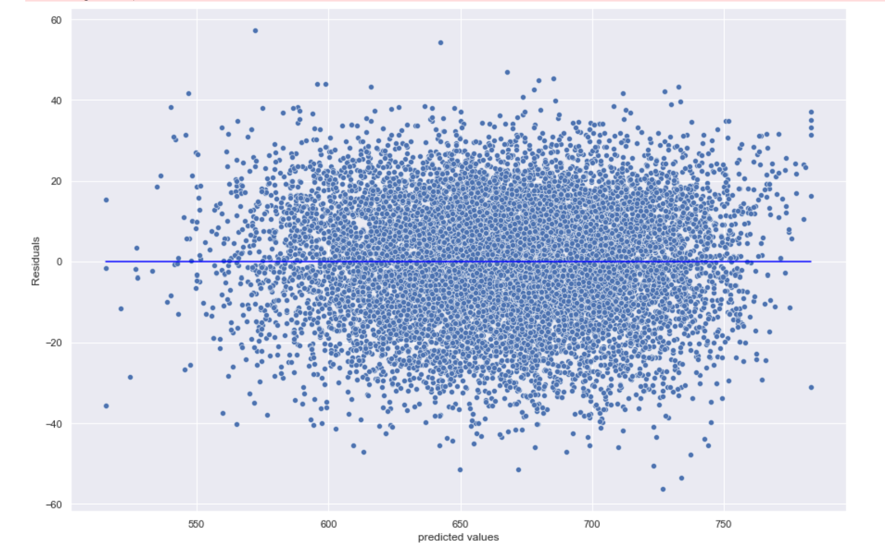
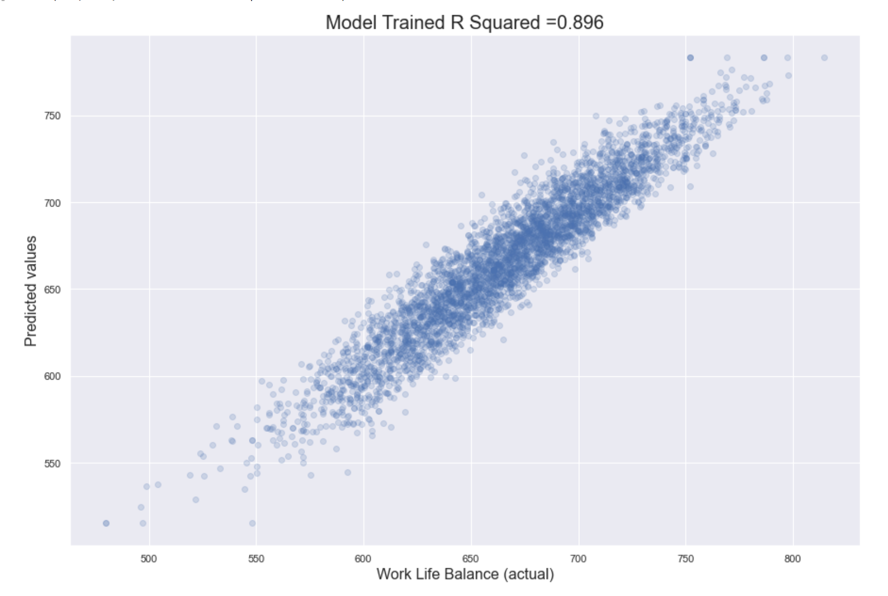
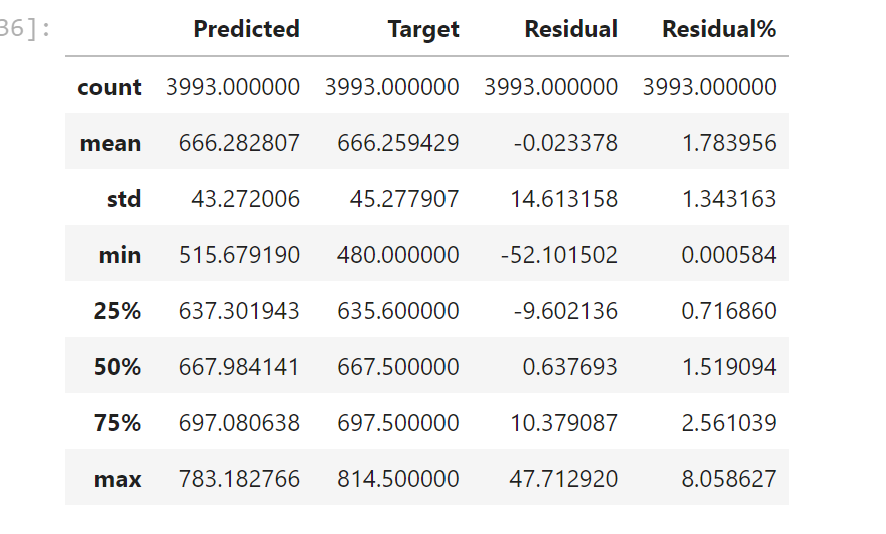

# :key: To Achieve Work-life Balance

## :memo:Overview:
Link dataset: https://www.kaggle.com/datasets/ydalat/lifestyle-and-wellbeing-data/code

Reference: 

https://towardsdatascience.com/analyze-the-data-through-data-visualization-using-seaborn-255e1cd3948e

https://github.com/taufiqbashori/wellbeing-regression/blob/main/Work_Life_Balance_MultiRegression%20(1).ipynb

https://www.kaggle.com/code/ydalat/work-life-balance-survey-eda#1.-Data-Import-and-Preparation

This dataset contains 15,977 survey responses with 24 attributes describing how we live our lives.
<details>
<summary>
Click here to expand attributes!
</summary>
 
1. FRUITS_VEGGIES: HOW MANY FRUITS OR VEGETABLES DO YOU EAT EVERYDAY?
2. DAILY_STRESS: HOW MUCH STRESS DO YOU TYPICALLY EXPERIENCE EVERYDAY?
3. PLACES_VISITED: HOW MANY NEW PLACES DO YOU VISIT?
4. CORE_CIRCLE: HOW MANY PEOPLE ARE VERY CLOSE TO YOU?
5. SUPPORTING_OTHERS: HOW MANY PEOPLE DO YOU HELP ACHIEVE A BETTER LIFE?
6. SOCIAL_NETWORK: WITH HOW MANY PEOPLE DO YOU INTERACT WITH DURING A TYPICAL DAY?
7. ACHIEVEMENT: HOW MANY REMARKABLE ACHIEVEMENTS ARE YOU PROUD OF?
8. DONATION: HOW MANY TIMES DO YOU DONATE YOUR TIME OR MONEY TO GOOD CAUSES?
9. BMI_RANGE: WHAT IS YOUR BODY MASS INDEX (BMI) RANGE?
10. TODO_COMPLETED: HOW WELL DO YOU COMPLETE YOUR WEEKLY TO-DO LISTS?
11. FLOW: IN A TYPICAL DAY, HOW MANY HOURS DO YOU EXPERIENCE "FLOW"?
12. DAILY_STEPS: HOW MANY STEPS (IN THOUSANDS) DO YOU TYPICALLY WALK EVERYDAY?
13. LIVE_VISION: FOR HOW MANY YEARS AHEAD IS YOUR LIFE VISION VERY CLEAR FOR?
14. SLEEP_HOURS: ABOUT HOW LONG DO YOU TYPICALLY SLEEP?
15. LOST_VACATION: HOW MANY DAYS OF VACATION DO YOU TYPICALLY LOSE EVERY YEAR ?
16. DAILY_SHOUTING: HOW OFTEN DO YOU SHOUT OR SULK AT SOMEBODY?
17. SUFFICIENT_INCOME: HOW SUFFICIENT IS YOUR INCOME TO COVER BASIC LIFE EXPENSES?
18. PERSONAL_AWARDS: HOW MANY RECOGNITIONS HAVE YOU RECEIVED IN YOUR LIFE?
19. TIME_FOR_PASSION: HOW MANY HOURS DO YOU SPEND EVERYDAY DOING WHAT YOU ARE PASSIONATE ABOUT?
20. WEEKLY_MEDITATION: IN A TYPICAL WEEK, HOW MANY TIMES DO YOU HAVE THE OPPORTUNITY TO THINK ABOUT YOURSELF?
21. GENDER: MALE OR FEMALE
22. AGE: 21 to 35, 36 to 50, 51 and more, less than 20
23. WORK_LIFE_BALANCE_SCORE: SCORE CALCULATED BY AH.COM ALGORITHM AND REPORTED TO USER IN THE FIRST REPORT

</details>


## :open_file_folder:Objectives:
* In order to reinvent our lifestyles and optimize our individual wellbeing, I extracted valuable insights from this dataset.
* Afterall, I created a **Multiple Linear Regression** to see what predictors of a balanced life are

## :open_file_folder:Table of contents:
1. [Cleaning and EDA](#cleaning-and-eda)
2. [Building linear regression model](#multiple-linear-regression)
3. [Checking model](#check-multicollinearity-by-vif)
4. [Insights from model](#check-feature-weight)

## :pill:Summarized Insights 

1. **How to have a healthy body ?**
* **Activities we participate daily** play a role in physical health.
* It's recommended to mind what we consume: **diets which include more fruits and veggies** are suggested.
2. **How to have a healthy mind ?**
* **Meditation** can help us to ease stress. From my own experience, It does not require meditating for long time. It can take under many forms: 5 minutes sit down and breath is great as well to calm down and reduce stress.
* **Engaging in what we are doing** also reduces stress. The feeling after engaging and finishing something makes us feel proud and save time to do other things we love. In order to do that, we have to find what we are passionate about to do.
* When we finish work, do not forget to **spend time for relaxing**. Vacation is important, don't lose any change to enjoy life.
4. **How to grow expertise and achieve what I dream of ?**
* **Focusing** help to grow our expertise and achieve things we want. Focusing leads to finishing required tasks.
* **Quality of sleeps** plays an important role in how we work. Because It determines how we focus on what we are doing.
6. **Is connection important? How to make more friends ?**
* Connections is of paramount importance. There is a proverb saying that "If you want to go far, go together". More friends we have, more supports we get.
*  **Traveling** and **interacting with people daily** can make our friend circle expand.


# ANALYTICS PROCESS

## IMPORT LIBRARIES & DATASET

As usual, I used pandas to input data from csv. 

In order to display all columns, I used this line of code: **pd.pandas.set_option("display.max_column",None)**.
```python
import pandas as pd
import numpy as np
import matplotlib.pyplot as plt
import seaborn as sns
pd.pandas.set_option("display.max_column",None)

data = pd.read_csv("Wellbeing_and_lifestyle_data_Kaggle.csv")
df = data.copy()
 ```

## CLEANING AND EDA

### Transfer non-numeric datatype into numeric

When inspecting the data, I found that feature DAILY_STRESS was in wrong datatype, object instead of numerical type.

So I used **to_numeric** of pandas to transform. There are nulls so I used **parameter: errors="coerce"**

```python
# using to_numeric with errors = coerce to transfer non-numeric into nan
df.DAILY_STRESS = pd.to_numeric(df.DAILY_STRESS,errors="coerce")
 ```
 
### Fill daily_stress with median

There are not too much nulls in this column(below 10%). I used common approach **"median"** to replace those nulls

```python
#Check null or not
df.DAILY_STRESS.isnull().sum()

#fill with median
df.DAILY_STRESS.fillna(df.DAILY_STRESS.median(), inplace=True)
 ```


 ### Categorical exploration


```python
# Gender and Age
pd.crosstab(df.GENDER,df.AGE, normalize=True).plot(kind="bar")
 ```
 
 
=> According to the bar graph, It shows that most people were from 21 to 50 anticipating in the survey. There are more females than males

```python
# BMI and gender
pd.crosstab(df.GENDER,df.BMI_RANGE, normalize=True).plot(kind="bar")
 ```
 
 

 
 => It shows that both male and female anticipants have Body Mass Index(BMI) below 21, but not equal. Female rates are higher than those of male.
 
 However, it's hard to make a consumption.
 
#### Healthy body, reflecting your fitness and healthy habits
In the survey, BMI index was calculated in this way: your body mass in kg divided by the square of your height in meters 

```python
df2 = df.pivot_table(values='BMI_RANGE', index=['AGE'], columns=['GENDER'], )
df2.head()

# Physical health
f,ax = plt.subplots(2,2,figsize=(16,10))
ax[0,0].set_title('BMI_RANGE BETWEEN AGE')
ax[0,1].set_title('DAILY STEP VS BMI_RANGE')
ax[1,0].set_title('EATING HABIT VS BMI_RANGE')

# ax[0,0].set_ylim([3.5, 4.5])
df2.plot(kind='bar', ax = ax[0,0])
ax[0,0].tick_params(axis='x', rotation=0)

sns.pointplot(x = 'DAILY_STEPS',  y = 'BMI_RANGE',  data=df, ax = ax[0,1])
sns.pointplot(x = 'FRUITS_VEGGIES',  y = 'BMI_RANGE',  data=df, ax = ax[1,0])

f.suptitle('PHYSICAL HEALTH\nWHAT AFFECTS OUR BODY MASS INDEX?', fontsize=20)
plt.show()
 ```
 

1. Start from the left high corner, the graph shows that people, who are from 21 to 51 and more, share approximately same figure among male and female.
2. Looke at the right high graph, it shows the relationship between daily steps and BMI index. It's obvious that the more you walk, more weight you lose.
3. How about eating habit ? the last graph shows that consuming fruit and veggies also helps to lose weights.
 

#### Healthy mind, indicating how well you embrace positive emotions

In the survey, 'Flow' is defined as the mental state, in which you are fully immersed in performing an activity. You then experience a feeling of energized focus, full involvement, and enjoyment in the process of this activity. __It was measure by how many hours you experience "flow"__
 
```python
df3 = df.pivot_table(values='DAILY_STRESS', index=['AGE'], columns=['GENDER'], )
df3.head()

# Daily stress
f,ax = plt.subplots(2,2,figsize=(12,10))
ax[0,0].set_title('DAILY STRESS BETWEEN AGES')
ax[0,1].set_title('DAILY STRESS VS MEDITATION')
ax[1,0].set_title('DAILY STRESS VS FLOW')
ax[1,1].set_title('DAILY STRESS VS LOST VACATION')


df3.plot(kind='bar', ax = ax[0,0])
ax[0,0].tick_params(axis='x', rotation=0)

sns.pointplot(x = 'WEEKLY_MEDITATION',  y = 'DAILY_STRESS',  data=df, ax = ax[0,1])
sns.pointplot(x = 'FLOW',  y = 'DAILY_STRESS',  data=df, ax = ax[1,0])
sns.pointplot(x = 'LOST_VACATION',  y = 'DAILY_STRESS',  data=df, ax = ax[1,1])


f.suptitle('HEALTHY MIND\nWHAT DRIVE US TO ACHIEVE A HEALTHY MIND?', fontsize=20)
plt.show()
 ```
 


1. Firstly, let's look at stress the participants experience daily. It's easy to see that in most ages, females are more stressful than males, especially under 35. 
   * It may happen because when young women feel more insecure about the appearence
   * Or when they have lots of things to take care of like children, particularly when they are pregnant.
2. Does mediation help to ease stress? It seems like it can. At right hight corner, the graph shows that the more participants meditated, less stress they experienced.
3. At the left bottom corner, the graph also shows that when they experienced more flow at work, that feeling helped them to reduce stress. 
4. It's intersting that when they lost vacations, especially above 6 vacations, they felt more stressfull. However, whey they lost so many vaction, from 7 vacations, it did not differ much from losing 6 vacations.


#### Expertise, measuring the ability to grow your expertise and achieve something unique

 
```python
df4 = df.pivot_table(values='ACHIEVEMENT', index=['AGE'], columns=['GENDER'])
df4.head()

# EXPERTISE
f,ax = plt.subplots(2,2,figsize=(14,10))
ax[0,0].set_title('AVERAGE ACHIEVEMENTS BY AGE')
ax[0,1].set_title('ACHIEVEMENTS vs TODO_COMPLETED')
ax[1,0].set_title('ACHIEVEMENTS & DAILY HOURS OF FLOW')
ax[1,1].set_title('ACHIEVEMENTS & HOURS OF SLEEP')


df4.plot(kind='bar', ax = ax[0,0])
ax[0,0].tick_params(axis='x', rotation=0)

sns.pointplot(x = 'TODO_COMPLETED',  y = 'ACHIEVEMENT',  data=df, ax = ax[0,1])
sns.pointplot(x = 'FLOW',  y = 'ACHIEVEMENT',  data=df, ax = ax[1,0])
sns.pointplot(x = 'SLEEP_HOURS', y = 'ACHIEVEMENT',  data=df, ax = ax[1,1])

f.suptitle('PERSONAL ACHIEVEMENTS\nWHAT DRIVE US TO ACHIEVE REMARKABLE THINGS?', fontsize=20)
plt.show()
 ```
 

1. First, look at personal achievements and ages. It shows that under 35, females were more proud of themselves than males were. However, above 36, males felt more proud of themselves. 
2. The other 3 graphs show that **"flow" hours**, **tasks completed** and **sleep hours** all contributed to the amount personal achievements they got.    

#### Connection, assessing the strength of your social network and your inclination to discover the world

In the survey, core_circle was measured by "how many people are very close to you".
 
```python
df5 = df.pivot_table(values='CORE_CIRCLE', index=['AGE'], columns=['GENDER'])

# Connection
f,ax = plt.subplots(2,2,figsize=(16,10))
ax[0,0].set_title('CORE CIRCLE BETWEEN AGE')
ax[0,1].set_title('CORE CIRCLE VS ACHIEVEMENT')
ax[1,0].set_title('CORE CIRCLE VS PLACE VISITED')
ax[1,1].set_title('CORE CIRCLE VS SOCIAL_NETWORK')


df5.plot(kind='bar', ax = ax[0,0])
ax[0,0].tick_params(axis='x', rotation=0)

sns.pointplot(x = 'ACHIEVEMENT', y = 'CORE_CIRCLE',  data=df, ax = ax[0,1])
sns.pointplot(x = 'PLACES_VISITED', y = 'CORE_CIRCLE',  data=df, ax = ax[1,0])
sns.pointplot(x = 'SOCIAL_NETWORK', y = 'CORE_CIRCLE',  data=df, ax = ax[1,1])


f.suptitle('ASSESSING SOCIAL CONNECTION', fontsize=20)
plt.show()
 ```
 
 
 1. The graph from the left high corner shows that mostly females had more close supports than males. It could be the reason why men feel more lonely :)
 2. The graphs of core_circle with social network and core_cirle with place_visited shows that places they visited, amount of people they interact everyday all contributed to amount of close friends you have.
 3. It's interesting that when they had more achievements, their circle expanded.
 
 
 #### Meaning, evaluating your compassion, generosity and how much 'you are living the life of your dream'.

In the survey, time for passion was measure by : Daily hours spent doing what you are passionate and dreaming about, and/or contributing to a greater cause: health, education, peace, society development, ...
 
```python
df6 = df.pivot_table(values='TIME_FOR_PASSION', index=['AGE'], columns=['GENDER'], )
df6.head()

f,ax = plt.subplots(2,2,figsize=(12,10))
ax[0,0].set_title('TIME FOR PASSION AMONG AGE')
ax[0,1].set_title('TODO_COMPLETED VS TIME FOR PASSION')
ax[1,0].set_title('FLOW & TIME FOR PASSION')
ax[1,1].set_title('PERSONAL_AWARDS &TIME FOR PASSION')

df6.plot(kind='bar', ax = ax[0,0])
ax[0,0].tick_params(axis='x', rotation=0)

sns.pointplot(x = 'TODO_COMPLETED',  y = 'TIME_FOR_PASSION',  data=df,  ax = ax[0,1])
sns.pointplot(x = 'FLOW',  y = 'TIME_FOR_PASSION',  data=df, ax = ax[1,0])
sns.pointplot(x = 'PERSONAL_AWARDS', y = 'TIME_FOR_PASSION',  data=df, ax = ax[1,1])

f.suptitle('TIME FOR PASSION\nWHAT AFFECT YOUR TIME FOR PASSION?', fontsize=20)
plt.show()
 ```
 

1. Firstly, time for passion among ages show not much difference. However, male in early ages, under 20, they spent more time for passion than femaled did.
2. It's obvious that when they finished work or experienced flow in work, they had more time to spend for their passion.
3. Moreover, when they spent time for passion, the more personal awards they had.

```python
# Sufficient and gender
## Sufficient means: HOW SUFFICIENT IS YOUR INCOME TO COVER BASIC LIFE EXPENSES
pd.crosstab(df.GENDER,df.SUFFICIENT_INCOME, normalize=True).plot(kind="bar")
 ```

 
 
It is a binary question: HOW SUFFICIENT IS YOUR INCOME TO COVER BASIC LIFE EXPENSES? 

According to the graph, It shows that women rates are higher than those of male. 

It could be because of 2 potential reasons:
1. More females anticipating than males
2. Females care about finance than males. Because those guys either make less money or give their partners their money :)
 
## Multiple Linear Regression

### Feature Transformation & Selection

#### Replace values for easy understanding

In this step, I replaced 2 binary features: BMI_RANGE AND SUFFICIENT_INCOME for intuitive understanding.
1. BMI was replaced by BMI < 25(index below 25 means thinner) and BMI > 25
2. SUFFICIENT_INCOME was replaced by Not or hardly sufficient and sufficient, meaning how the anticipants felt about their income

```python
#BMI_RANGE
df.BMI_RANGE.replace({1: "BMI < 25", 2: "BMI > 25"}, inplace=True)

#SUFFICIENT_INCOME
df.SUFFICIENT_INCOME.replace({1: "Not or hardly sufficient", 2: "Sufficient"}, inplace=True)
 ```

#### Get dummies categorical features

In this step, I used **get_dummies** to transform the categorical features for machine learning.

I dropped the first column to avoid redundancy.

```python
BMI = pd.get_dummies(df.BMI_RANGE,drop_first=True)
INCOME = pd.get_dummies(df.SUFFICIENT_INCOME,drop_first=True)
AGE = pd.get_dummies(df.AGE,drop_first=True)
GENDER = pd.get_dummies(df.GENDER,drop_first=True)
 ```
 
 
#### DROP unessarry columns

Then I dropped unnecessary columns.

```python
df.drop(["Timestamp","GENDER","BMI_RANGE","SUFFICIENT_INCOME","AGE"],axis=1,inplace=True)
 ```

#### CONCATENATE created features

```python
df = pd.concat([df, BMI, INCOME, AGE, GENDER],axis=1)
 ```

#### Skewness transformation

##### Check skewness 

In this step, I visualized to see how skewness my features were.

Any features had skewness above 0.25, then those were considered highly skewed. 

```python
skewness_dict = {}
for column in df.columns:
    if df[column].dtypes == "int64" or df[column].dtypes == "float64":
        skewness_dict[column] = df[column].skew()
    else:
        continue
## Sort based on absolute value because which values above 0.25 are considered highly skewed
skewness = sorted(skewness_dict.items(),key=lambda element: abs(element[1]), reverse=True)
sns.set(rc={'figure.figsize': (15,10)})

#assign x and y for barplot
x_1 = []
for row in skewness:
    value = row[0]
    x_1.append(value)

y_1 = []
for row in skewness:
    value = row[1]
    y_1.append(value)

#plot 
plot = sns.barplot(x=x_1, y=y_1)
for item in plot.get_xticklabels():
    item.set_rotation(90)

plot.set_title("Feature Skewness ", fontsize = 16)
plot.set_xlabel("Features", fontsize = 12)
plot.set_ylabel("Skewness", fontsize = 12)
 ```
 

 
=> According to the graph, there were 8 highly skewed features, which needed to be transformed.

##### Transform skewness data using yeo-johnson

In order to transform the skewed features, I used yeo-johnson in scipy to do the magic job.

```python
from scipy import stats
from scipy.stats import yeojohnson
transformed_skew = {}
parameters_skew = {}
for col in x_1[:8]:
    transformed_skew[col + "_transformed"], parameters = stats.yeojohnson(df[col])
    parameters_skew[col+"_transformed"] = parameters

transformed_df = pd.DataFrame(transformed_skew)
 ```

##### Re-check skewness

After skewing the feature, let's visualize to see how it worked.

```python
skewness_dict_transformed = {}
for column in transformed_df.columns:
        skewness_dict_transformed[column] = transformed_df[column].skew()
## Sort based on absolute value because which values above 0.25 are considered highly skewed
skewness_transformed = sorted(skewness_dict_transformed.items(),key=lambda element: abs(element[1]), reverse=True)
sns.set(rc={'figure.figsize': (15,10)})

#assign x and y for barplot
x_2 = []
for row in skewness_transformed:
    value = row[0]
    x_2.append(value)

y_2 = []
for row in skewness_transformed:
    value = row[1]
    y_2.append(value)

#plot 
plot = sns.barplot(x=x_2, y=y_2)
for item in plot.get_xticklabels():
    item.set_rotation(90)

plot.set_title("Feature Post Skewness ", fontsize = 16)
plot.set_xlabel("Features", fontsize = 12)
plot.set_ylabel("Skewness", fontsize = 12)
 ```


=> It worked quite well. It reduced the skewness of those featured below 0.25

 
## Train model

## Created 2 datasets for orginal df and transformed_df

```python
# skewed_df
skewed_df = pd.concat((df.drop(columns = [col for col in x_1[:8]]),transformed_df), axis=1)
skewed_df

#non_skew_df
df
 ```

### Check correlation between predictors and target feature

Firstly, I checked original dataset
```python
corr_df = pd.DataFrame(df.corr())
corr_df["WORK_LIFE_BALANCE_SCORE"].sort_values()
 ```
 
Then I started to remove uncorrelated features manually. How ? First, I begun with the smallest absolute value of correlation above. After that, I scaled and applied to test dataset.

After done some testing, I finally removed these features. Why ? Because If I continued to remove, the R2 score of the model decreased. I ended up with 90% R2 score
I would remove features which were nearly 0. Those are features relating to Gender and Age.
```python
df.drop(["DAILY_SHOUTING","LOST_VACATION","BMI > 25","Male","Less than 20",
                                  "36 to 50","51 or more","SLEEP_HOURS","DAILY_STRESS"], axis=1, inplace=True)
 ```
 
 
Finally, I repeated with the skewed dataset
```python
corr_skew_df = pd.DataFrame(skewed_df.corr())
corr_skew_df["WORK_LIFE_BALANCE_SCORE"].sort_values()
 ```
 

I would also proceeded the same tasks as above.
```python
skewed_df.drop(["DAILY_SHOUTING_transformed","LOST_VACATION_transformed","BMI > 25","Male","Less than 20",
                                  "36 to 50","51 or more","SLEEP_HOURS_transformed","DAILY_STRESS"], axis=1, inplace=True)
 ```

### Create X and Y for 2 datasets

I created predictor features and target feature for orginal dataset(x_1, y_1) and skewed dataset(x_2, y_2).

```python
# preprocessing
from sklearn.preprocessing import MinMaxScaler

x_1 = df.drop(columns = ["WORK_LIFE_BALANCE_SCORE"], axis=1)
y_1 = df.WORK_LIFE_BALANCE_SCORE

## skewed dataset
x_2 = skewed_df.drop(columns = ["WORK_LIFE_BALANCE_SCORE"], axis=1)
y_2 = skewed_df.WORK_LIFE_BALANCE_SCORE
 ```
 

### Scaling numeric features

To scale all features into same unit, I used **MinMaxScaler** to transform them.

Firstly, I scaled the original dataset(without skewing).
```python
# our scaler
scaler = MinMaxScaler()

# fit the scaler to our data
numeric_x_1 = x_1.drop(columns = ["Sufficient"],axis =1 )

scaled_numeric_x_1 = pd.DataFrame(scaler.fit_transform(numeric_x_1), columns = numeric_x_1.columns)

x_1 = pd.concat((scaled_numeric_x_1,x_1[['Sufficient']]),axis=1)
```

Then, I scaled the skewed dataset.
```python
# our scaler
scaler = MinMaxScaler()

# fit the scaler to our data
numeric_x_2 = x_2.drop(columns = ["Sufficient"],axis =1 )

scaled_numeric_x_2 = pd.DataFrame(scaler.fit_transform(numeric_x_2), columns = numeric_x_2.columns)

x_2 = pd.concat((scaled_numeric_x_2,x_2[['Sufficient']]),axis=1)
 ```
 
 
### Check R2

```python
from sklearn.model_selection import train_test_split
X_train, X_test, y_train, y_test = train_test_split(x_1, y_1,test_size=0.3)

from sklearn.metrics import mean_absolute_error
from sklearn.metrics import mean_squared_error
from sklearn.metrics import r2_score
from sklearn import linear_model

regr = linear_model.LinearRegression()
regr.fit(X_train,y_train)
y_pred = regr.predict(X_train)

print("R squared: {}".format(r2_score(y_true=y_train,y_pred=y_pred)))
 ```
 => R squared: 0.9090063321377624
 
It's good.
 
 
```python
X_train, X_test, y_train, y_test = train_test_split(x_2, y_2,test_size=0.25)

from sklearn.metrics import mean_absolute_error
from sklearn.metrics import mean_squared_error
from sklearn.metrics import r2_score
from sklearn import linear_model

regr = linear_model.LinearRegression()
regr.fit(X_train,y_train)
y_pred = regr.predict(X_train)

print("R squared: {}".format(r2_score(y_true=y_train,y_pred=y_pred)))
 ```
 => R squared for skewed dataset: 0.9077558180532218
 
These results are the same. Let's check multicollinearity of both datasets to see whether there are something unsual.
 
### Check Multicollinearity by VIF

In order to avoid multicollinearity(possibility of independent variables correlating to each others) when doing multiple linear regression, I used VIF to check.

Firstly, I checked multicollinearity of the original dataset
```python
from statsmodels.stats.outliers_influence import variance_inflation_factor

# the independent variables set
X = df.drop(columns = ["WORK_LIFE_BALANCE_SCORE"], axis=1)
  
# VIF dataframe
vif_data = pd.DataFrame()
vif_data["feature"] = X.columns
  
# calculating VIF for each feature
vif_data["VIF"] = [variance_inflation_factor(X.values, i)
                          for i in range(len(X.columns))]
  
vif_data.sort_values(by='VIF', ascending = False)
 ```


There are some features that are highly correlated between them.

```python
# vif for skew df
# the independent variables set
X = skewed_df.drop(columns = ["WORK_LIFE_BALANCE_SCORE"], axis=1)
  
# VIF dataframe
vif_data = pd.DataFrame()
vif_data["feature"] = X.columns
  
# calculating VIF for each feature
vif_data["VIF"] = [variance_inflation_factor(X.values, i)
                          for i in range(len(X.columns))]
  
vif_data.sort_values(by='VIF', ascending = False)
 ```


Again, this skewed dataset also has some features that are highly correlated between them.

**So I decided to remove those high multicolinear features to see which datasets are better**


### Re-compare R2 after removing hight multicolinear

This section again I did the testing. I checked manually which features are highly multicorrelated and infeasible by removing and comparing R2 score.

At the end, I decided to remove these features
```python
# Split datasets
x_1 = df.drop(columns = ["WORK_LIFE_BALANCE_SCORE","TODO_COMPLETED","SOCIAL_NETWORK"], axis=1)
y_1 = df.WORK_LIFE_BALANCE_SCORE

x_2 = skewed_df.drop(columns = ["WORK_LIFE_BALANCE_SCORE","ACHIEVEMENT_transformed","FLOW_transformed"], axis=1)
y_2 = skewed_df.WORK_LIFE_BALANCE_SCORE


# Scaling original dateset
scaler = MinMaxScaler()
# fit the scaler to our data
numeric_x_1 = x_1.drop(columns = ['Sufficient'],axis =1 )
scaled_numeric_x_1 = pd.DataFrame(scaler.fit_transform(numeric_x_1), columns = numeric_x_1.columns)
x_1 = pd.concat((scaled_numeric_x_1,x_1[['Sufficient']]),axis=1)

# Scaling skewed dateset
# fit the scaler to our data
numeric_x_2 = x_2.drop(columns = ['Sufficient'],axis =1 )
scaled_numeric_x_2 = pd.DataFrame(scaler.fit_transform(numeric_x_2), columns = numeric_x_2.columns)
x_2 = pd.concat((scaled_numeric_x_2,x_2[['Sufficient']]),axis=1)
 ```
 
 Then I compared their R2 Score
 
 Firstly, started with the original dataset.
 ```python
from sklearn.model_selection import train_test_split
X_train, X_test, y_train, y_test = train_test_split(x_1, y_1,test_size=0.3)

from sklearn.metrics import mean_absolute_error
from sklearn.metrics import mean_squared_error
from sklearn.metrics import r2_score
from sklearn import linear_model

regr = linear_model.LinearRegression()
regr.fit(X_train,y_train)
y_pred = regr.predict(X_train)

print("R squared: {}".format(r2_score(y_true=y_train,y_pred=y_pred)))
 ```
R squared of original dataset: 0.8873278439946326

It's not bad.

Then finished with skewed dataset
 ```python
from sklearn.model_selection import train_test_split
X_train, X_test, y_train, y_test = train_test_split(x_2, y_2,test_size=0.25)

from sklearn.metrics import mean_absolute_error
from sklearn.metrics import mean_squared_error
from sklearn.metrics import r2_score
from sklearn import linear_model

regr = linear_model.LinearRegression()
regr.fit(X_train,y_train)
y_pred = regr.predict(X_train)

print("R squared: {}".format(r2_score(y_true=y_train,y_pred=y_pred)))
 ```
 R squared of skewed dataset: 0.8958410485958109
 
**=> I decided to use skewed dataset when it explained almost 90% of variation around its mean better than skewed dataset**.


### Chech Multivariate Normality

I plotted a scatter graph to check how residuals are distributed: is it normally distributted ?

```python
residuals = y_train.values - y_pred
# Plot the residual
p = sns.distplot(residuals,kde=True)
p = plt.title('Normality of residuals')
 ```
 
 

**=> Residual distribution is normall distributed. It's good!**

 
 
### Check Homoscedasticity


```python
p = sns.scatterplot(y_pred,residuals)
plt.xlabel('predicted values')
plt.ylabel('Residuals')
p = sns.lineplot([y_pred.min(),y_pred.max()],[0,0],color='blue')
 ```



**=> There is no clear pattern between residuals and predicted values. It's good**


## Applying model to test dataset

Then I applied the model to test dataset to evaluate it.

```python
pred_y = regr.predict(X_test)

R2_test = regr.score(X_test,y_test) 
from matplotlib import pyplot as plt
plt.scatter(y_test, pred_y, alpha = 0.2)
plt.xlabel('Work Life Balance (actual)', size = 16)
plt.ylabel('Predicted values', size = 16)

plt.title('Model Trained R Squared ='+ '{number:.3f}'.format(number=R2_test), size = 20)
 ```



**=> It explained nearly 90% test dataset. Look good!!!**


### Check residuals

```python
residual_df = pd.DataFrame(pred_y, columns = ['Predicted'])
y_test = y_test.reset_index (drop = True)
residual_df["Target"] = y_test
residual_df["Residual"] = residual_df["Target"] - residual_df["Predicted"]
residual_df["Residual%"] = abs((residual_df["Target"] - residual_df["Predicted"])/residual_df["Target"]*100)
residual_df.describe()
 ```



 
**=> In worste case, max residual percentage is 8%. It means expecting standard deviation to be 9% different from actual values**


## Check feature weight

Last but not least, let's see which features affect our work life. These features were ranked based on their absolute coefficient values, meaning the top feature affects our work life balance the most.

```python
reg_summary = pd.DataFrame(x.columns.values, columns = ["Features"])
reg_summary["Weights"] = regr.coef_

# plot bar chart
f, ax = plt.subplots(figsize=(15, 6))
sns.barplot(x="Weights", y="Features", data=reg_summary.sort_values("Weights", ascending=False, key = abs),
            label="Weights")
ax.set_title("Feature Weights in Linear Regression",fontsize=20)      
 ```
 


According to the graph, I could suggest some following insights:

1. As you can see, **Personal Awards** ranks highest, which means every personal achievement you get, you add nearly 28 point to the score. It is true, at least myself. Whenever I achieved something I am passionate about, it made my day. 
2. At the second place, **Weekly mediation** and **Live vision** are almost the same. It can be interpreted as when you start to focus on innerself, that is when you feel good.

=> After this analysis, I learned this: when I feel peace, happiness inside, that is the time I start 

 
