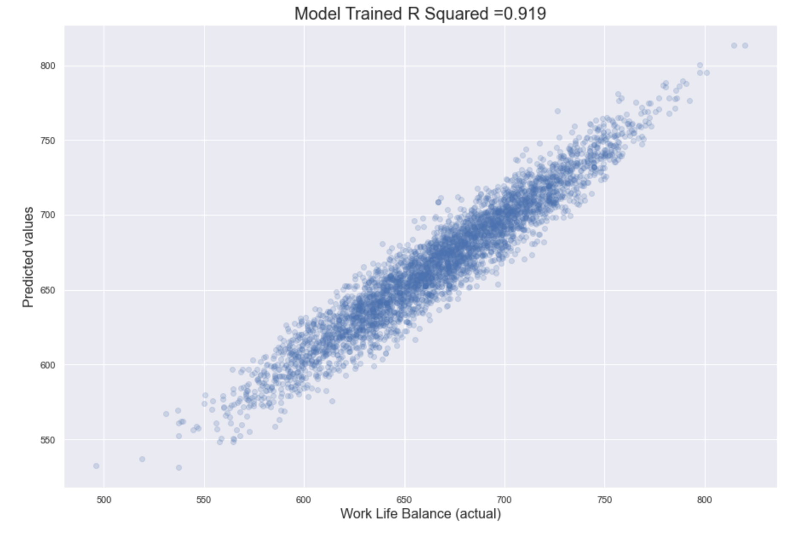

# GOAL OF PROJECT

I want to know which factors affecting our life, whether or not based on some factors to predict quality of life

Link dataset: https://www.kaggle.com/datasets/ydalat/lifestyle-and-wellbeing-data/code

I refered to this github: https://github.com/taufiqbashori/wellbeing-regression/blob/main/Work_Life_Balance_MultiRegression%20(1).ipynb


# INSIGHTS 

Let

# ANALYTICS PROCESS

## IMPORT LIBRARIES & DATASET

As usual, I used pandas to input data from csv. 

In order to display all columns, I used this line of code: **pd.pandas.set_option("display.max_column",None)**.
```python
import pandas as pd
import numpy as np
import matplotlib.pyplot as plt
import seaborn as sns
pd.pandas.set_option("display.max_column",None)

data = pd.read_csv("Wellbeing_and_lifestyle_data_Kaggle.csv")
df = data.copy()
 ```

## CLEANING & EDA

### Transfer non-numeric datatype into numeric

When inspecting the data, I found that feature DAILY_STRESS was in wrong datatype, object instead of numerical type.

So I used **to_numeric** of pandas to transform. There are nulls so I used **parameter: errors="coerce"**

```python
# using to_numeric with errors = coerce to transfer non-numeric into nan
df.DAILY_STRESS = pd.to_numeric(df.DAILY_STRESS,errors="coerce")
 ```
 
### Fill daily_stress with median

There are not too much nills in this column(below 10%). I used common approach **"median"** to replace those nulls

```python
#Check null or not
df.DAILY_STRESS.isnull().sum()

#fill with median
df.DAILY_STRESS.fillna(df.DAILY_STRESS.median(), inplace=True)
 ```


 ### Categorical exploration


```python
# Gender and Age
pd.crosstab(df.GENDER,df.AGE, normalize=True).plot(kind="bar")
 ```
 
 
=> According to the bar graph, It shows that most people were from 21 to 50 anticipating in the survey. There are more females than males


#### Healthy body, reflecting your fitness and healthy habits
```python
# BMI and gender
pd.crosstab(df.GENDER,df.BMI_RANGE, normalize=True).plot(kind="bar")
 ```
 
 

 
 => It shows that both male and female anticipants have Body Mass Index(BMI) below 21, but not equal. Female rates are higher than those of male.
 
 However, it's hard to make a consumption.


```python
df2 = df.pivot_table(values='BMI_RANGE', index=['AGE'], columns=['GENDER'], )
df2.head()

# Physical health
f,ax = plt.subplots(2,2,figsize=(16,10))
ax[0,0].set_title('BMI_RANGE BETWEEN AGE')
ax[0,1].set_title('DAILY STEP VS BMI_RANGE')
ax[1,0].set_title('EATING HABIT VS BMI_RANGE')

# ax[0,0].set_ylim([3.5, 4.5])
df2.plot(kind='bar', ax = ax[0,0])
ax[0,0].tick_params(axis='x', rotation=0)

sns.pointplot(x = 'DAILY_STEPS',  y = 'BMI_RANGE',  data=df, ax = ax[0,1])
sns.pointplot(x = 'FRUITS_VEGGIES',  y = 'BMI_RANGE',  data=df, ax = ax[1,0])

f.suptitle('PHYSICAL HEALTH\nWHAT AFFECTS OUR BODY MASS INDEX?', fontsize=20)
plt.show()
 ```
 

 

#### Healthy mind, indicating how well you embrace positive emotions

'Flow' is defined as the mental state, in which you are fully immersed in performing an activity.

 You then experience a feeling of energized focus, full involvement, and enjoyment in the process of this activity.
 
```python
df3 = df.pivot_table(values='DAILY_STRESS', index=['AGE'], columns=['GENDER'], )
df3.head()

# Daily stress
f,ax = plt.subplots(2,2,figsize=(12,10))
ax[0,0].set_title('DAILY STRESS BETWEEN AGES')
ax[0,1].set_title('DAILY STRESS VS MEDITATION')
ax[1,0].set_title('DAILY STRESS VS FLOW')
ax[1,1].set_title('DAILY STRESS VS LOST VACATION')


df3.plot(kind='bar', ax = ax[0,0])
ax[0,0].tick_params(axis='x', rotation=0)

sns.pointplot(x = 'WEEKLY_MEDITATION',  y = 'DAILY_STRESS',  data=df, ax = ax[0,1])
sns.pointplot(x = 'FLOW',  y = 'DAILY_STRESS',  data=df, ax = ax[1,0])
sns.pointplot(x = 'LOST_VACATION',  y = 'DAILY_STRESS',  data=df, ax = ax[1,1])


f.suptitle('HEALTHY MIND\nWHAT DRIVE US TO ACHIEVE A HEALTHY MIND?', fontsize=20)
plt.show()
 ```
 


#### Expertise, measuring the ability to grow your expertise and achieve something unique

 
```python
df4 = df.pivot_table(values='ACHIEVEMENT', index=['AGE'], columns=['GENDER'])
df4.head()

# EXPERTISE
f,ax = plt.subplots(2,2,figsize=(14,10))
ax[0,0].set_title('AVERAGE ACHIEVEMENTS BY AGE')
ax[0,1].set_title('ACHIEVEMENTS vs TODO_COMPLETED')
ax[1,0].set_title('ACHIEVEMENTS & DAILY HOURS OF FLOW')
ax[1,1].set_title('ACHIEVEMENTS & HOURS OF SLEEP')


df4.plot(kind='bar', ax = ax[0,0])
ax[0,0].tick_params(axis='x', rotation=0)

sns.pointplot(x = 'TODO_COMPLETED',  y = 'ACHIEVEMENT',  data=df, ax = ax[0,1])
sns.pointplot(x = 'FLOW',  y = 'ACHIEVEMENT',  data=df, ax = ax[1,0])
sns.pointplot(x = 'SLEEP_HOURS', y = 'ACHIEVEMENT',  data=df, ax = ax[1,1])

f.suptitle('PERSONAL ACHIEVEMENTS\nWHAT DRIVE US TO ACHIEVE REMARKABLE THINGS?', fontsize=20)
plt.show()
 ```
 


#### Connection, assessing the strength of your social network and your inclination to discover the world

 
```python

 ```
 


```python
# Sufficient and gender
## Sufficient means: HOW SUFFICIENT IS YOUR INCOME TO COVER BASIC LIFE EXPENSES
pd.crosstab(df.GENDER,df.SUFFICIENT_INCOME, normalize=True).plot(kind="bar")
 ```

 
 
It is a binary question: HOW SUFFICIENT IS YOUR INCOME TO COVER BASIC LIFE EXPENSES? 

According to the graph, It shows that women rates are higher than those of male. 

It could be because of 2 potential reasons:
1. More females anticipating than males
2. Females care about finance than males. Because those guys either make less money or give their partners their money :)
 
## PREDICTION MODEL

### Feature Transformation & Selection

#### Replace values for easy understanding

In this step, I replaced 2 binary features: BMI_RANGE AND SUFFICIENT_INCOME for intuitive understanding.
1. BMI was replaced by BMI < 25(index below 25 means thinner) and BMI > 25
2. SUFFICIENT_INCOME was replaced by Not or hardly sufficient and sufficient, meaning how the anticipants felt about their income

```python
#BMI_RANGE
df.BMI_RANGE.replace({1: "BMI < 25", 2: "BMI > 25"}, inplace=True)

#SUFFICIENT_INCOME
df.SUFFICIENT_INCOME.replace({1: "Not or hardly sufficient", 2: "Sufficient"}, inplace=True)
 ```

#### Get dummies categorical features

In this step, I used **get_dummies** to transform the categorical features for machine learning.

I dropoed the first column to avoid redundancy.

```python
BMI = pd.get_dummies(df.BMI_RANGE,drop_first=True)
INCOME = pd.get_dummies(df.SUFFICIENT_INCOME,drop_first=True)
AGE = pd.get_dummies(df.AGE,drop_first=True)
GENDER = pd.get_dummies(df.GENDER,drop_first=True)
 ```
 
 
#### DROP unessarry columns

Then I dropped unnecessary columns.

```python
df.drop(["Timestamp","GENDER","BMI_RANGE","SUFFICIENT_INCOME","AGE"],axis=1,inplace=True)
 ```

#### CONCATENATE created features

```python
df = pd.concat([df, BMI, INCOME, AGE, GENDER],axis=1)
 ```

#### Skewness transformation

##### Check skewness 

In this step, I visualized to see how skewness my features were.

Any features had skewness above 0.25, then those were considered highly skewed. 

```python
skewness_dict = {}
for column in df.columns:
    if df[column].dtypes == "int64" or df[column].dtypes == "float64":
        skewness_dict[column] = df[column].skew()
    else:
        continue
## Sort based on absolute value because which values above 0.25 are considered highly skewed
skewness = sorted(skewness_dict.items(),key=lambda element: abs(element[1]), reverse=True)
sns.set(rc={'figure.figsize': (15,10)})

#assign x and y for barplot
x_1 = []
for row in skewness:
    value = row[0]
    x_1.append(value)

y_1 = []
for row in skewness:
    value = row[1]
    y_1.append(value)

#plot 
plot = sns.barplot(x=x_1, y=y_1)
for item in plot.get_xticklabels():
    item.set_rotation(90)

plot.set_title("Feature Skewness ", fontsize = 16)
plot.set_xlabel("Features", fontsize = 12)
plot.set_ylabel("Skewness", fontsize = 12)
 ```
 

 
=> According to the graph, there were 8 highly skewed features, which needed to be transformed.

##### Transform skewness data using yeo-johnson

In order to transform the skewed features, I used yeo-johnson in scipy to do the magic job.

```python
from scipy import stats
from scipy.stats import yeojohnson
transformed_skew = {}
parameters_skew = {}
for col in x_1[:8]:
    transformed_skew[col + "_transformed"], parameters = stats.yeojohnson(df[col])
    parameters_skew[col+"_transformed"] = parameters

transformed_df = pd.DataFrame(transformed_skew)
 ```

##### Re-check skewness

After skewing the feature, let's visualize to see how it worked.

```python
skewness_dict_transformed = {}
for column in transformed_df.columns:
        skewness_dict_transformed[column] = transformed_df[column].skew()
## Sort based on absolute value because which values above 0.25 are considered highly skewed
skewness_transformed = sorted(skewness_dict_transformed.items(),key=lambda element: abs(element[1]), reverse=True)
sns.set(rc={'figure.figsize': (15,10)})

#assign x and y for barplot
x_2 = []
for row in skewness_transformed:
    value = row[0]
    x_2.append(value)

y_2 = []
for row in skewness_transformed:
    value = row[1]
    y_2.append(value)

#plot 
plot = sns.barplot(x=x_2, y=y_2)
for item in plot.get_xticklabels():
    item.set_rotation(90)

plot.set_title("Feature Post Skewness ", fontsize = 16)
plot.set_xlabel("Features", fontsize = 12)
plot.set_ylabel("Skewness", fontsize = 12)
 ```


=> It worked quite well. It reduced the skewness of those featured below 0.25

### Created 2 datasets for orginal df and transformed_df

```python
# skewed_df
skewed_df = pd.concat((df.drop(columns = [col for col in x_1[:8]]),transformed_df), axis=1)
skewed_df

#non_skew_df
df
 ```
 
### Check Multicollinearity by VIF

In order to avoid multicollinearity(possibility of independent variables correlating to each others) when doing multiple linear regression, I used VIF to check.

```python
import statsmodels.api as sm
from scipy import stats
from statsmodels.stats.outliers_influence import variance_inflation_factor

# def calc VIF
def cal_vif(X):
    vif = pd.DataFrame()
    vif["VIF Factor"] = [variance_inflation_factor(X.values, i) for i in range(X.shape[1])]
    vif["features"] = X.columns
    return vif
    
# vif for non_skew df
vif_df = cal_vif(df.drop(columns = "WORK_LIFE_BALANCE_SCORE"))
vif_df.sort_values(by="VIF Factor", ascending=False)
 ```


There are some features that are highly correlated between them(above 5)

```python
# vif for skew df
vif_skewed_df = cal_vif(skewed_df.drop(columns = "WORK_LIFE_BALANCE_SCORE"))
vif_skewed_df.sort_values(by="VIF Factor", ascending=False)
 ```


Again, this skewed dataset also has some features that are highly correlated between them.


#### Re-calc VIF

With those correlated features, I removed them.

```python
# vif for non_skew df which removed columns having VIF above 5.5
vif_df_2 = cal_vif(df.drop(columns = ["WORK_LIFE_BALANCE_SCORE", "SLEEP_HOURS", "TODO_COMPLETED", 
                                    "SOCIAL_NETWORK", "FRUITS_VEGGIES","WEEKLY_MEDITATION",
                                    "SUPPORTING_OTHERS", "PERSONAL_AWARDS"], axis=1))
vif_df_2.sort_values(by="VIF Factor", ascending=False)
 ```
 

I did the same for skewed dataset.

```python
# vif for skewed df which removed columns having VIF above 5.5
vif_skewed_df_2 = cal_vif(skewed_df.drop(columns = ["WORK_LIFE_BALANCE_SCORE", "SLEEP_HOURS_transformed", "ACHIEVEMENT_transformed", 
                                    "SOCIAL_NETWORK", "FLOW_transformed","TODO_COMPLETED_transformed",
                                    "FRUITS_VEGGIES", "TIME_FOR_PASSION_transformed", "WEEKLY_MEDITATION",
                                    "SUPPORTING_OTHERS"], axis=1))
vif_skewed_df_2.sort_values(by="VIF Factor", ascending=False)
 ```


## Train model

### Create X and Y for 2 datasets

I created predictor features and target feature for orginal dataset(x_1, y_1) and skewed dataset(x_2, y_2).

```python
# preprocessing
from sklearn.preprocessing import MinMaxScaler, StandardScaler
from sklearn.model_selection import train_test_split

x_1 = df.drop(columns = ["WORK_LIFE_BALANCE_SCORE", "SLEEP_HOURS", "TODO_COMPLETED", 
                                    "SOCIAL_NETWORK", "FRUITS_VEGGIES","WEEKLY_MEDITATION",
                                    "SUPPORTING_OTHERS", "PERSONAL_AWARDS"], axis=1)
y_1 = df.WORK_LIFE_BALANCE_SCORE

## skewed dataset
x_2 = skewed_df.drop(columns = ["WORK_LIFE_BALANCE_SCORE", "SLEEP_HOURS_transformed", "ACHIEVEMENT_transformed", 
                                    "SOCIAL_NETWORK", "FLOW_transformed","TODO_COMPLETED_transformed",
                                    "FRUITS_VEGGIES", "TIME_FOR_PASSION_transformed", "WEEKLY_MEDITATION",
                                    "SUPPORTING_OTHERS"], axis=1)
y_2 = skewed_df.WORK_LIFE_BALANCE_SCORE

 ```
 

### Scaling numeric features

To scale all features into same unit, I used **MinMaxScaler** to transform them.

```python
# our scaler
scaler = MinMaxScaler()


# fit the scaler to our data
numeric_x_1 = x_1.drop(columns = ['BMI > 25', 'Sufficient',
       '36 to 50', '51 or more', 'Less than 20', 'Male'],axis =1 )

scaled_numeric_x_1 = pd.DataFrame(scaler.fit_transform(numeric_x_1), columns = numeric_x_1.columns)

x_1 = pd.concat((scaled_numeric_x_1,x_1[['BMI > 25', 'Sufficient',
       '36 to 50', '51 or more', 'Less than 20', 'Male']]),axis=1)


 # our scaler
scaler = MinMaxScaler()

# fit the scaler to our data
numeric_x_2 = x_2.drop(columns = ['BMI > 25', 'Sufficient',
       '36 to 50', '51 or more', 'Less than 20', 'Male'],axis =1 )

scaled_numeric_x_2 = pd.DataFrame(scaler.fit_transform(numeric_x_2), columns = numeric_x_2.columns)

x_2 = pd.concat((scaled_numeric_x_2,x_2[['BMI > 25', 'Sufficient',
       '36 to 50', '51 or more', 'Less than 20', 'Male']]),axis=1)
 ```
 
 
### Check R2

```python
from sklearn.model_selection import train_test_split
X_train, X_test, y_train, y_test = train_test_split(x_1, y_1,random_state = 0,test_size=0.25)

from sklearn.metrics import mean_absolute_error
from sklearn.metrics import mean_squared_error
from sklearn.metrics import r2_score
from sklearn import linear_model

regr = linear_model.LinearRegression()
regr.fit(X_train,y_train)
y_pred = regr.predict(X_train)

print("R squared for orginal dataset: {}".format(r2_score(y_true=y_train,y_pred=y_pred)))
 ```
 => R squared for orginal dataset: 0.9218224459993715
 
 
```python
X_train, X_test, y_train, y_test = train_test_split(x_2, y_2,random_state = 0,test_size=0.25)

regr = linear_model.LinearRegression()
regr.fit(X_train,y_train)
y_pred = regr.predict(X_train)

print("R squared for skewed dataset: {}".format(r2_score(y_true=y_train,y_pred=y_pred)))
 ```
 => R squared for skewed dataset: 0.8648375006226039
 
**=> I decided to used original dataset when it explained 92% of variation around its mean better than skewed dataset**.

### Chech Multivariate Normality

I plotted a scatter graph to check how residuals are distributed: is it normally distributted ?

```python
residuals = y_train.values - y_pred
# Plot the residual
p = sns.distplot(residuals,kde=True)
p = plt.title('Normality of residuals')
 ```
 
 

**=> Residual distribution is normall distributed. It's good!**

 
 
### Check Homoscedasticity


```python
p = sns.scatterplot(y_pred,residuals)
plt.xlabel('predicted values')
plt.ylabel('Residuals')
p = sns.lineplot([y_pred.min(),y_pred.max()],[0,0],color='blue')
 ```


**=> There is no clear pattern between residuals and predicted values. It's good**


## Applying model to test dataset

Then I applied the model to test dataset to evaluate it.

```python
pred_y = regr.predict(X_test)

R2_test = regr.score(X_test,y_test) 
from matplotlib import pyplot as plt
plt.scatter(y_test, pred_y, alpha = 0.2)
plt.xlabel('Work Life Balance (actual)', size = 16)
plt.ylabel('Predicted values', size = 16)

plt.title('Model Trained R Squared ='+ '{number:.3f}'.format(number=R2_test), size = 20)
 ```



**=> It explained 91% test dataset. Look good!!!**


### Check residuals

```python
residual_df = pd.DataFrame(pred_y, columns = ['Predicted'])
y_test = y_test.reset_index (drop = True)
residual_df["Target"] = y_test
residual_df["Residual"] = residual_df["Target"] - residual_df["Predicted"]
residual_df["Residual%"] = abs((residual_df["Target"] - residual_df["Predicted"])/residual_df["Target"]*100)
residual_df.describe()
 ```


 
**=> In worste case, max residual percentage is 7%. It means expecting standard deviation to be 9% different from actual values**


## Check feature weight

Last but not least, let's see which features affect our work life

```python
reg_summary = pd.DataFrame(x.columns.values, columns = ["Features"])
reg_summary["Weights"] = regr.coef_

# plot bar chart
f, ax = plt.subplots(figsize=(15, 6))
sns.barplot(x="Weights", y="Features", data=reg_summary.sort_values("Weights", ascending=False, key = abs),
            label="Weights")
ax.set_title("Feature Weights in Linear Regression",fontsize=20)      
 ```
 


According to the graph, we can see that achievement was the most important factor in work-life balance.


 
